# suvannmedia media stack

Production configuration for the Bazzite media server. This repository is the
source of truth for the deployed systemd units, install scripts, Cloudflare
tunnel template, FileFlows flow, and operational checks.

## Production architecture



<sub>The editable Mermaid source is [docs/media-stack-architecture.mmd](docs/media-stack-architecture.mmd).</sub>

- **Media:** the single ext4 filesystem at `/var/mnt/pool1` (also reachable as
  `/mnt/pool1`) on the SSI hardware-RAID5 USB enclosure.
- **Application state:** `/home/skim/jellyfin-configs` on the internal NVMe.
  It holds every application database, configuration directory, cache, and the
  FileFlows runner scratch directory.
- **Containers:** rootful, system-level Podman units for Jellyfin, the Arr
  apps, Cleanuparr, and Flaresolverr. FileFlows, Gluetun, and qBittorrent are rootless user
  units for `skim`; Cloudflared runs as a system service.
- **Ingress:** Cloudflare Tunnel publishes the suvannmedia.com endpoints.
  qBittorrent shares Gluetun's network namespace; only Gluetun exposes its
  WebUI on `127.0.0.1:8090`, so the torrent client cannot bypass PIA.

`mergerfs`, the temporary drive-swap mounts, the temporary rclone TV mount,
and the legacy external-config mount are not part of this stack and are
intentionally absent from this repository.

## Services

- Jellyfin — `8096` — `docker.io/jellyfin/jellyfin@sha256:78d3ea1207d1322471fcac39a614f004f2ccf7e878f95ab2977d752f07e4dd7e`
- Jellyseerr — `5055` — `docker.io/seerr/seerr@sha256:f4768de5f616248d723e05891f3345a1402123775d03bf0890dbfedc0831bda1` (config is `/app/config`)
- SABnzbd — `8085` — `docker.io/linuxserver/sabnzbd@sha256:948ea3dc45d68943ec14b33ba37ffa1488da3e9837bf3ca0f75621e971614d85`
- Prowlarr — `9696` — `docker.io/linuxserver/prowlarr@sha256:c96b56d94d116a9f4de94bc23d3381689492e6c3cfb7435320e8d982e406f99a`
- Radarr — `7878` — `docker.io/linuxserver/radarr@sha256:adb6c09d6b729ea5e642c99cea35af72702ef476bf4763f153299ac5db9f0b4f`
- Sonarr — `8989` — `docker.io/linuxserver/sonarr@sha256:a5c1a5fecbef946927ab90ad68df319ac5fe644057e5fc18cd993f01ac07b2b2`
- Bazarr — `6767` — `docker.io/linuxserver/bazarr@sha256:d24bd0048c759a468970989e9df11a6b96a7628d556d00f923e60a35ba59237b`
- Cleanuparr — `11011` — Arr/qBittorrent queue monitor — `ghcr.io/cleanuparr/cleanuparr@sha256:c813a155d0a43b5eb91353f269affe376a211d2ffcb15c1bc3aa76d2d55e5bee`
- Flaresolverr — `8191`, internal only — `docker.io/flaresolverr/flaresolverr@sha256:c80ae007ce2ccdcd217a12426e4f039ef763ff90738c808d38810c3e59323767`
- FileFlows — `5000` — `localhost/fileflows-amd-vaapi:latest`
- Gluetun — PIA OpenVPN, rootless user service
- qBittorrent — exposed through Gluetun on `8090`, rootless user service
- Cloudflared — system service; see `cloudflare/config.yml.template`

Registry-backed container references are pinned by immutable digest in the units
and updater. The digests were resolved from the current source tags; changing what
runs requires a deliberate digest update and review.

The live tunnel routes `jellyfin`, `jellyseerr`, `sabnzbd`, `prowlarr`,
`radarr`, `sonarr`, `bazarr`, `cleanuparr`, `fileflows`, and `qbittorrent` under
`suvannmedia.com`. Flaresolverr has no public route. Cleanuparr is protected by
its own Cloudflare Access application; direct LAN access is separate from that
public Access gate.

## Storage and SELinux invariants

Do not move application databases onto the USB media volume. Keep
`/home/skim/jellyfin-configs/fileflows/runner-temp` on the NVMe: FileFlows
runner startup is metadata-heavy and RAID-backed scratch causes severe startup
latency even for no-op work.

Rootful containers need traversal permission and a persistent SELinux label:

```bash
sudo chmod 711 /home/skim
sudo semanage fcontext -a -t container_file_t \
  '/var/home/skim/jellyfin-configs(/.*)?'
sudo restorecon -RF /var/home/skim/jellyfin-configs
```

The media mounts in the rootful units use `:z` where required. Do not add `:z`
to the rootless FileFlows media mount.

## Deploy or recover

1. Mount the production media filesystem at `/var/mnt/pool1`.
2. Clone this repository and prepare `/home/skim/jellyfin-configs` with the
   label above.
3. Build the FileFlows image if it is not already present:

```bash
podman run -d --name ff-builder docker.io/revenz/fileflows@sha256:1f412e4e2b411a18d25538095629ef870185ea602f9840caab06088dec8231ae
podman exec -u 0 ff-builder apt update
podman exec -u 0 ff-builder apt install -y \
  ffmpeg vainfo mesa-va-drivers intel-media-va-driver-non-free
podman commit ff-builder localhost/fileflows-amd-vaapi:latest
podman rm -f ff-builder
```

4. Install the system and FileFlows units:

```bash
sudo bash install/setup.sh
```

5. For torrent fallback, copy `torrent/.env.example` to the gitignored
   `torrent/.env`, then follow `torrent/README.md`.
6. Configure or restore the Cloudflare tunnel with
   `cloudflare/install_tunnel.sh`.

The installer creates the FileFlows NVMe scratch directory, deploys the system
units, enables the FileFlows user unit with lingering, and performs localhost
HTTP probes. It does not store credentials.

## FileFlows flow

`fileflows/flows/20Mbps Bitrate V4.json` is the checked-in flow. It caps video
above 20 Mbps using VAAPI with CPU fallback, preserves the HDR-oriented media
workflow, and normalizes compatible AC3/EAC3 5.1 audio. Import it with
`fileflows/import_flows.sh` if the existing FileFlows database was not restored.

## Operations

- `scripts/media-stack-health.sh` checks the `/var/mnt/pool1` mount, service
  HTTP endpoints, and failed units. It is intentionally silent when healthy.
- `scripts/media-stack-updater.sh` reconciles the reviewed image digests and
  Cloudflared. Adopt a newer container build by updating the digest in the units
  and updater, then testing before deployment.
- `scripts/fix-media-permissions.sh` repairs ownership/SELinux issues.
- `docs/RECOVERY.md` is the disaster-recovery procedure.
- `docs/CLEANUPARR.md` documents Cleanuparr's safe operating policy and recovery.

Never put passwords, API keys, tunnel credentials, or application databases in
the repository.
